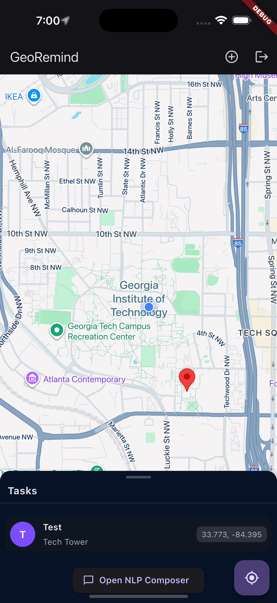
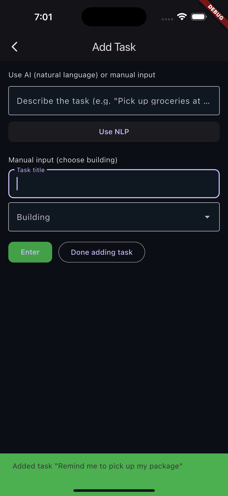

# GeoRemind  
An intelligent, location-aware task manager that reminds you to complete tasks exactly when you’re in the right place.  
**Built as our HackGT 12 project using Flutter + Firebase.**

---

## Inspiration  
As students on a massive campus like Georgia Tech, we constantly found ourselves saying, *“Oh, I was just at the Student Center, I completely forgot to pick up my package!”* The mental load of remembering location-specific tasks is real. Forgetting to grab a book from the library or return an Amazon package while walking right past the pickup spot is frustrating and inefficient.  

We wanted to build an app that **does the remembering for you**—letting your **location trigger your to-do list**.

---

## What It Does  
GeoRemind helps users tie tasks to locations:  

- Create a reminder like **“Pick up Amazon package”** and attach it to the **John Lewis Student Center**.  
- Our app continuously and efficiently monitors your location in the background.  
- The moment you enter a **100-meter radius**, a notification instantly pops up reminding you to grab your package.  
- Proof-of-concept: **Automatic Gmail scanning** to detect package delivery emails and create reminders for you.

---

## Screens & Demo  
<div style="display: flex; justify-content: space-between;">
  
  
  
</div>

**Quick walkthrough:**  
Open the app → Login using Google or Email → Add a task using AI (NLP) or manual input → See your tasks pinned on the map → Get notified when you’re near the location.  

---

## Features  
- Location-based reminders that trigger at the right place  
- Gmail integration (prototype) for automatic package reminder creation  
- Live GPS tracking with efficient background geofencing  
- Smart cooldown logic to prevent notification spam  
- Firebase-powered user authentication and cross-device reminder sync  
- Cross-platform support for **iOS, Android, and Web**  

---

## How We Built It  
- **Frontend:** Flutter (Dart) for a single codebase across iOS, Android, and Web  
- **Backend & Database:** Firebase Firestore (real-time NoSQL database) + Firebase Authentication  
- **APIs & Services:** Google Maps Platform for maps & location search, Gmail API for email scanning  
- **Core Logic:** `geolocator` package for GPS tracking, `flutter_local_notifications` for OS-level alerts  
- **Collaboration:** Git & GitHub, managed within VS Code  

---

## Challenges We Ran Into  
- Debugging native build issues (CocoaPods, iOS permissions, Info.plist, Xcode quirks)  
- Managing efficient background location tracking without draining battery  
- Navigating Gmail API OAuth 2.0 authentication under hackathon time pressure  
- Balancing scope vs. feasibility—we pivoted to a simulated email scan for a smooth demo  

---

## Accomplishments We’re Proud Of  
- Shipped a **full-stack, cross-platform mobile app in just 36 hours**  
- Implemented an efficient continuous location listener with geofence triggers  
- Built cooldown logic to keep notifications useful instead of overwhelming  
- Collaborated effectively under 36-hour time pressure and delivered a polished demo  

---

## What We Learned  
- End-to-end mobile app development: from native setup to deployment  
- Prioritization under deadlines—focusing on features that would wow in a demo  
- Debugging and integrating complex APIs (Maps, Gmail, Firebase)  
- The value of collaboration, version control, and quick pivots  

---

## What’s Next for GeoRemind  
- ✨ **AI-powered Lifestyle Analysis** for optimized notifications to avoid clutter
- ✅ **Full Gmail integration** with OAuth 2.0 for live package detection  
- 📅 **Calendar sync** to auto-create reminders for events with locations  
- ⏰ **Time-based conditions** (e.g., *“After 5 PM when near the library”*)  
- 😴 **Snooze + AI-powered smart suggestions** for common reminders  

---

## Tech Stack  
- **Languages & Frameworks:** Dart, Flutter  
- **Backend & Services:** Firebase (Firestore, Authentication)  
- **APIs:** Google Maps Platform, Gmail API  
- **Tools:** Git, GitHub, VS Code, Xcode  
- **Packages:** `geolocator`, `flutter_local_notifications`  

---

## Setup (Run in 2 Minutes)
1. Clone the repo:  
```bash
git clone https://github.com/yourusername/GeoRemind.git  
cd GeoRemind  
```  
2. Open in VS Code or Android Studio  
3. Run:
   ```bash
   flutter pub get
   ```  
4. Connect a simulator or device and run:
   ```bash  
   flutter run  
   ```  

---

## Credits & Inspiration  
- HackGT 12 for providing the platform  
- Google Maps & Firebase docs  
- Flutter community packages (`geolocator`, `flutter_local_notifications`)  

---

## License & Contact
All rights reserved.  
**Team:** GeoRemind @ HackGT 12  
[georemindgt@gmail.com]  

**Authors**:  
[https://linkedin.com/in/aadijuthani]  
[https://www.linkedin.com/in/roque-arduengo-470848304/]  
